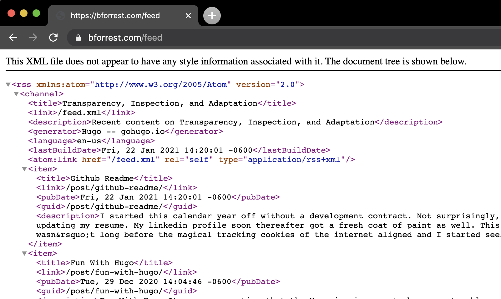

## Blog post extract not working.

Here's a feed generated from a Hugo site

Compared with a feed from a Wordpress site

My Sesame Stree education informs me that one of these things is not like the others and I'm guessing that the Hugo feed doesn't belong with the Github Action.

